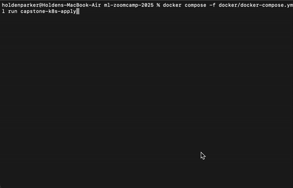

# Capstone
I decided to build a model to determine what sport is being played in a given photo.

## Getting Started
This project utilizes Docker Compose to build and orchestrate containers.
This includes both the service and the jupyter notebook.
**To view the jupyter notebook, run the following command:**

```sh
docker compose -f docker/docker-compose.yml up -d capstone
```

The password to the jupyter notebook is `jupyter`, not a randomly generated token.
To access the notebook, open your browser to [http://localhost:6594/](http://localhost:6594/).

> **_I would recommend reviewing the code, but not executing the entire notebook._**

While the notebook will fully run end-to-end, it will take hours to complete.

**To run the containerized service, run the following command:**

```sh
docker compose -f docker/docker-compose.yml up -d capstone-service
```

## Using the service
The last cell in the `capstone.ipynb` notebook includes an easy-to-use setp to test with different images.
However, you can also use a tool like `curl` to test the service:

```sh
curl -v -X POST http://localhost:9698/predict \
  -F "file=@capstone/data/test/football/4.jpg"
```

> **Note:** In the jupyter notebook, you will see the url is `http://capstone-service:9697` while `curl` uses `http://localhost:9698`.
> We use `capstone-service` because the jupyter notebook and the service are both deployed in docker and share the same network.
> We can use `localhost` with `curl` because I've exposed the `9698` port in the `docker-compose.yml` file.
> I exposed port `9698` and mapped it to the internal port `9697` to avoid collisions with the kubernetes deployment.

**To stop the containerized service, run the following command:**

```sh
docker compose -f docker/docker-compose.yml stop capstone-service
```

## Deploying to a k8s cluster
I have included light-weight kubernetes manifest files to support deploying this service to kubernetes.
This setup is designed and tested using the built-in Docker Desktop kubernetes cluster on a Mac machine.
I have not tested this on a Windows machine, and I do not expect it to work there seamlessly.
Theoretically, you may be able to change the `.kube/config` volume mount in the `docker-compose.yml` file to point to your kube config and things may work seamlessly.
```yaml
  capstone-k8s-apply:
    image: alpine/kubectl
    volumes:
      # This mapping
      - ~/.kube/config:/root/.kube/config:ro
    ...
  capstone-k8s-delete:
    image: alpine/kubectl
    volumes:
      # And this mapping
      - ~/.kube/config:/root/.kube/config:ro
    ...
```
I have abstracted the tooling into docker containers to reduce the number of dependencies required on your local machine for testing.
**To run the kubernetes model service, you run the following command:**

```sh
docker compose -f docker/docker-compose.yml run capstone-k8s-apply
```

The service can be tested using a similar `curl` command as above, although note that the port is different:

```sh
curl -v -X POST http://localhost:9697/predict -F "file=@capstone/data/test/football/4.jpg"
```

**To stop the kubernetes model service, run the following command:**

```sh
docker compose -f docker/docker-compose.yml run capstone-k8s-delete
```

### Demo of k8s service workflow:


## Files
Here is an accounting of the different files in this project:
- `.python-version` _A file generated by uv._
- `capstone_model.keras` _The final model generated by `train.py` and used by the services._
- `capstone.ipynb` _The jupyter notebook containing my model research and tuning, along with a test command for convenience._
- `classes.json` _A programmatic accounting of the classes (recognized sports) in the model, generated by `train.py` and used by the service._
- `main.py` _The python file defining the Flask service._
- `pyproject.toml` _A file generated by uv._
- `README.md` _The file you're currently reading, that I'm hoping is helpful._
- `requirements.txt` _The base dependencies used by docker to build the jupyter notebook and start building the service._
- `train.py` _The final training script used to train and export the model._
- `uv.lock` _A file generated by uv._
- `data/` _The data I'm using for the project, sourced from [kaggle/sports-classification](https://www.kaggle.com/datasets/gpiosenka/sports-classification/data)._
- `docs/` _The recording for the k8s service demo._

## Related files not in the capstone directory
Here is an accounting of files used by the Capstone project that live elsewhere.
- `docker/docker-compose.yml` _The Docker Compose definition file, allowing for easy and consistent deployment of containers to docker._
- `docker/Dockerfile.jupyter` _Defines the jupyter notebook environment.  Includes targets for `homework`, `midterm`, and `capstone`.
- `docker/Dockerfile.capstone` _Defines the service image to be deployed by Docker Compose._
- `kubernetes/capstone` _Defines the k8s manifest files for a simple kubernetes deployment._